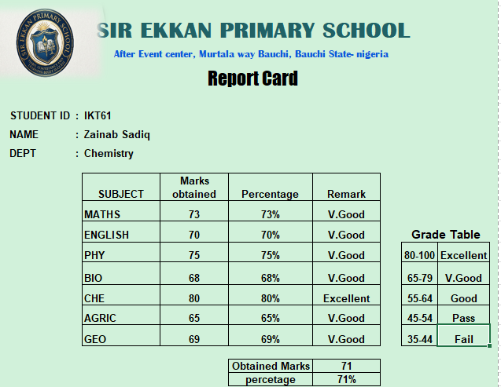
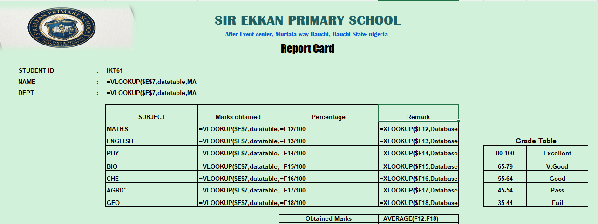

# Student Autamated Report Card

To Extract the students ID I used the Data Validation Function
while referencing the dataset i apply the VLOOKUP formulae to name which automatically changes with change inthe student ID
XLOOKUP formula was used to extract the scores referencing the dataset as table to keep look function and other were autofilled
## images 

percentage was obtained by dividing obtained marks by 100 and the remarks by XLOOKUP function
the entire work was done acurately giving details and precisions to the used formula
